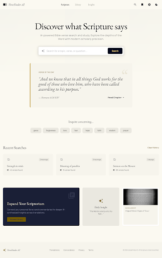
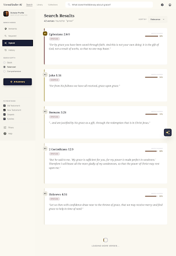
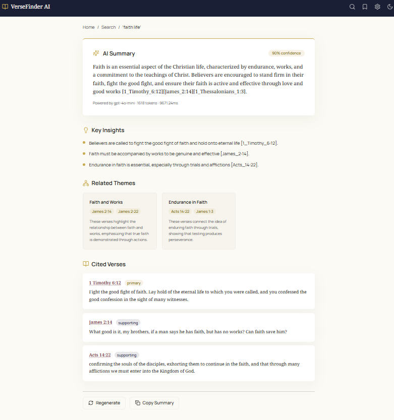
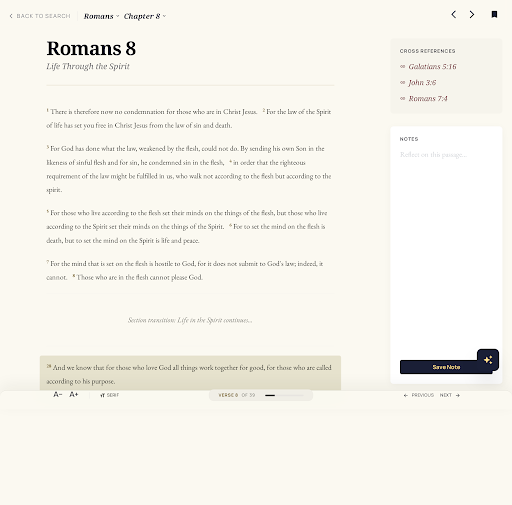
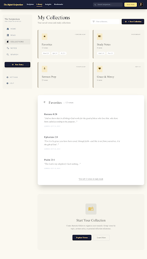

# Bible Verse Finder AI
[](https://opensource.org/licenses/MIT)

An intelligent Bible verse search engine powered by hybrid semantic + keyword retrieval with AI-powered summarization, featuring adaptive query classification and multiple LLM support.

## Table of Contents
- [Overview](#overview)
- [Features](#features)
- [UI Walkthrough](#ui-walkthrough)
- [Architecture](#architecture)
- [Installation](#installation)
- [Usage](#usage)
- [Configuration](#configuration)

## Overview

Bible Verse Finder AI is an advanced Bible search tool that goes beyond simple keyword matching. It allows users to search the Bible by meaning using natural language, leveraging a hybrid retrieval system that combines FAISS vector similarity search with BM25 keyword scoring through an adaptive Weighted Reciprocal Rank Fusion (RRF) algorithm.

The system classifies each query via a weighted blend of feature signals (named entity, exact phrase, single/multi-concept, general topic, comparative, verse reference) and produces a continuous alpha that adjusts the FAISS-vs-BM25 balance. Exact verse references like `John 3:16` or `1 Cor 13:4-7` short-circuit retrieval entirely and return the verse directly. Search results can be summarized by an LLM that provides cited key points, thematic connections, and a confidence score — all grounded strictly in the retrieved verses.

## Features

- **Hybrid Retrieval**: FAISS semantic search + BM25 keyword search fused via canonical Reciprocal Rank Fusion
- **Signal-Blending Query Classification**: Weighted blend over exact phrase, named entity, single/multi-concept, general topic, comparative signals — produces a continuous RRF weight rather than forcing each query into a single bucket
- **Verse-Reference Short-Circuit**: `John 3:16`, `1 Cor 13:4-7`, `Rom 8.28` skip FAISS + BM25 and return the exact verse(s) directly — no embedding call, ~5ms
- **Multi-LLM Support**: OpenAI (GPT-4o-mini), Google Gemini, and Grok (xAI) with automatic fallback for summarization
- **AI Summarization with Citations**: Every claim includes inline `[verse_id]` citations grounded in retrieved verses
- **Adjustable Analysis Depth**: Quick (7 verses), Balanced (12 verses), or Comprehensive (20 verses) summarization tiers
- **Full Chapter Reading**: View complete chapters with verse highlighting
- **Adaptive Thresholds**: FAISS cosine threshold, dynamic BM25 cutoff (relative to top hit), RRF threshold on a normalized 0–1 scale
- **Persistent Caching**: SQLite-backed embedding cache (default 90-day TTL) eliminates repeat OpenAI calls; summary cache (7-day TTL) survives restarts
- **Explore Mode**: Infinite scroll with per-result scoring breakdown (FAISS score, BM25 score, fusion score, ranks)
- **Pre-built Search Indices**: FAISS and BM25 indices ship with the repo — no re-embedding required
- **Search History**: Persisted recent searches for quick access
- **React + FastAPI Stack**: Modern responsive frontend with a production-ready API backend

## UI Walkthrough

### 1. Home Page

<p align="center">
  
</p>

The landing screen provides the primary entry point into Bible Verse Finder AI.

- **Hero search bar** — Type a topic, verse reference, or natural language question (e.g., "What does the Bible say about grace?") and press Enter or click Search to navigate to results.
- **Verse of the Day** — A curated verse displayed in serif typography with a gold accent border. Click **Read Chapter** to open the full chapter in the Bible Reader with that verse highlighted.
- **Topic pills** — Eight quick-access topic buttons (grace, forgiveness, love, fear, hope, faith, wisdom, prayer). Clicking any pill immediately runs a search for that topic.
- **Recent searches** — Shows your last 3 search queries with timestamps. Click any card to re-run that search. History is persisted across sessions via localStorage.

### 2. Search Results

<p align="center">
  
</p>

Displays ranked Bible verses matching your query with filtering controls.

- **Left sidebar (desktop)** — Contains three control groups:
  - **Search Mode** toggle — Switch between *Semantic* (AI meaning-based), *Keyword* (exact text match), or *Hybrid* (combined scoring). Hybrid is the default.
  - **Search Depth** — Choose *Quick* (top 10), *Balanced* (top 25), or *Comprehensive* (top 50) to control how many verses are analyzed.
  - **Summarize with AI** button — Navigates to the AI Summary view for the current query.
- **Results header** — Shows total verse count and the active query.
- **Verse cards** — Each result displays the verse reference, full text, relevance score bar with percentage match, book category tag, and hover actions (bookmark, copy, share).
- **Infinite scroll** — More results load automatically as you scroll down.
- **Click any verse card** to open the full chapter in the Bible Reader with that verse highlighted.

### 3. AI Summary

<p align="center">
  
</p>

An AI-generated analysis that synthesizes insights from matching verses.

- **AI Summary card** — The primary summary paragraph with a confidence score badge, inline clickable verse citations, and model metadata (LLM name, token count, response time).
- **Key Insights** — Bullet-pointed takeaways extracted from the verses, each with supporting verse references.
- **Related Themes** — Cards showing thematic connections (e.g., Salvation, Forgiveness, Faith). Each card lists connected verses as clickable pills and a brief explanation.
- **Cited Verses** — All referenced verses with relevance badges (*Primary*, *Supporting*, or *Contextual*) and full text. Click any reference to read in context.
- **Footer actions** — *Regenerate* re-runs the AI analysis; *Copy Summary* copies the text to clipboard.

### 4. Bible Reader

<p align="center">
  
</p>

A full-page, distraction-free reading experience (not a modal overlay).

- **Compact header** — Back button, book/chapter display, and previous/next chapter arrows.
- **Reading area** — Centered column (max 720px) with serif typography, generous line-height (1.9), gold superscript verse numbers, and warm gold highlighting on the navigated-from verse.
- **Verse actions** — Hover over any verse to reveal a bookmark button.
- **Font controls (bottom bar)** — Increase/decrease font size (14px–28px), verse count, and chapter navigation.
- The reader bypasses the main navigation shell for an immersive, Kindle-like experience.

### 5. Collections

<p align="center">
  
</p>

Organize and manage your saved verses in personal collections.

- **Favorites** — Default collection at the top. Verses are added by tapping the bookmark icon on any verse across the app.
- **Custom collections** — Create named collections (e.g., "Study Notes", "Sermon Prep") using the **+ New Collection** button. Each card shows name, verse count, and a preview of saved references.
- **Empty state** — New users see an instructional prompt with an "Explore Verses" button.
- All collection data is persisted to localStorage via Zustand's persist middleware.

### Navigation

| Platform | Navigation |
|----------|-----------|
| Desktop | Top nav bar with logo, search, bookmarks, settings, and dark mode toggle |
| Mobile | Bottom tab bar with Home, Search, Library, and Settings tabs |

Dark mode is toggled via the sun/moon icon in the header and persists across sessions.

## Architecture

The system features a sophisticated multi-component architecture:

### **Data Processing & Storage**
- **OpenAI text-embedding-3-small**: 1536-dimensional embeddings for semantic understanding
- **FAISS Vector Store**: High-performance cosine similarity search
- **BM25 Index**: Traditional keyword-based search with stemming via PyStemmer
- **Verse Metadata Store**: Complete Bible text with book and chapter metadata

### **Hybrid Retrieval System**
- **Canonical RRF**: each retriever contributes only when it actually returned the document:
  ```
  rrf = α × 1/(faiss_rank + k)    if doc in FAISS, else 0
      + (1-α) × 1/(bm25_rank + k) if doc in BM25,  else 0
  ```
  Normalized to [0, 1] before the RRF threshold is applied.
- **Signal-Blending Classifier**: weighted mean of per-signal target alphas, anchored by a baseline at `alpha_default`. Dominant signal is reported for observability; retrieval uses the blended α.
- **Continuous Alpha**: roughly [0.22, 0.75] depending on which signals fire. Exact-phrase-heavy queries pull toward keyword; general-topic-heavy queries pull toward semantic; mixed queries land in between.
- **Adaptive Thresholds**: FAISS cosine minimum (0.20 default), dynamic BM25 cutoff (`max(bm25_min_score, top × bm25_relative_threshold)`) to handle term-rarity scale, RRF minimum on normalized 0–1 scale (0.15 default).
- **Verse-Reference Short-Circuit**: parses `Book Chapter:Verse` (with common abbreviations and ranges), bypasses FAISS+BM25, returns via O(1) lookup.

### **LLM Integration**
- **OpenAI**: GPT-4o-mini for summarization (default)
- **Google Gemini**: Gemini 1.5 Flash as alternative provider
- **Grok (xAI)**: Grok Beta as alternative provider
- **Automatic Fallback**: Primary → OpenAI → Gemini → Grok → Error

### **API & Interface**
- **FastAPI Backend**: Production-ready API with health check, interactive Swagger docs, and CORS support
- **React + TypeScript Frontend**: Vite, shadcn/ui, TailwindCSS, Zustand state, TanStack Query
- **SQLite-Backed Caches** (`backend/vector_store/cache.db`): embedding cache (90-day TTL by default, or disable) saves repeat OpenAI calls; summary cache (7-day TTL) survives restarts. Both caches are size-cappable for constrained deployments.
- **O(1) Verse & Chapter Lookups**: `/verses/{id}` and `/chapters/{book}/{chapter}` use pre-built dicts, not linear scans over metadata.

## Installation

### Prerequisites
- Python 3.13+
- Node.js 18+ and npm
- [uv](https://docs.astral.sh/uv/) (Python package manager)
- OpenAI API key (required for embeddings and search)
- Optional: Gemini API key, Grok API key (for alternative summarization providers)

### Setup

1. Clone the repository:
   ```bash
   git clone https://github.com/richie-rk/Bible-VerseFinder-AI.git
   cd Bible-VerseFinder-AI
   ```

2. **Backend setup**:
   ```bash
   cd backend
   uv sync
   ```

3. **Frontend setup**:
   ```bash
   cd frontend
   npm install
   ```

4. **Environment configuration**:

   Create `backend/.env`:
   ```env
   OPENAI_API_KEY=sk-your-openai-api-key
   # GEMINI_API_KEY=your-gemini-api-key
   # GROK_API_KEY=your-grok-api-key
   # LLM_PROVIDER=openai
   ```

   > **Note**: The FAISS and BM25 search indices are pre-built and included in `backend/vector_store/`. No additional data setup is needed.
   >
   > **API keys**: `OPENAI_API_KEY` is required for semantic and hybrid search (the query is embedded at call time). Pure keyword search (`mode=keyword`) and verse-reference lookups (`John 3:16`) work without any API key. Summarization needs an OpenAI / Gemini / Grok key for whichever provider is active.

## Usage

### **Quick Start**

1. **Start the FastAPI backend**:
   ```bash
   cd backend
   uv run uvicorn app.main:app --reload
   ```

2. **In a separate terminal, start the React frontend**:
   ```bash
   cd frontend
   npm run dev
   ```

3. **Access the application**:
   - **React UI**: http://localhost:8080
   - **FastAPI docs**: http://localhost:8000/docs
   - **Health check**: http://localhost:8000/health

### **API Endpoints**

- `GET /search` - Search for Bible verses (semantic, keyword, or hybrid mode)
- `POST /summarize` - Generate AI summary with citations from search results
- `GET /verses/{verse_id}` - Get a specific verse by ID (e.g., `John_3:16`)
- `GET /chapters/{book}/{chapter}` - Get all verses from a specific chapter
- `GET /providers` - List available LLM providers
- `GET /health` - Check system status, index state, and verse count

## Configuration

The backend is fully configurable through environment variables or a `.env` file in the `backend/` directory:

### **Environment Variables**

```bash
# LLM Configuration
OPENAI_API_KEY=sk-your-key              # Required for semantic + hybrid search (query embeddings)
GEMINI_API_KEY=your-key                  # Optional: Gemini summarization
GROK_API_KEY=your-key                    # Optional: Grok summarization
LLM_PROVIDER=openai                      # Default provider: openai | gemini | grok

# Model Configuration
OPENAI_SUMMARIZATION_MODEL=gpt-4o-mini
GEMINI_SUMMARIZATION_MODEL=gemini-1.5-flash
GROK_SUMMARIZATION_MODEL=grok-beta

# Retrieval
SEARCH_K=200                             # Candidates per retriever before RRF fusion

# Thresholds
FAISS_THRESHOLD=0.20                     # Semantic cosine minimum
BM25_MIN_SCORE=0.1                       # Absolute BM25 floor (noise rejection)
BM25_RELATIVE_THRESHOLD=0.05             # Keep BM25 results >= 5% of top score
RRF_THRESHOLD=0.15                       # Normalized [0-1] RRF minimum
RRF_K=60                                 # RRF smoothing constant

# Caching (SQLite, backend/vector_store/cache.db)
EMBEDDING_CACHE_TTL_DAYS=90              # 0 = never expire
EMBEDDING_CACHE_MAX_ENTRIES=0            # 0 = no LRU cap
SUMMARY_CACHE_TTL_DAYS=7
SUMMARY_CACHE_MAX_ENTRIES=0

# Pagination
DEFAULT_PAGE_SIZE=50
MAX_PAGE_SIZE=100

# Alpha Target Values (signal-blending classifier — see claude/design-decisions.md)
ALPHA_NAMED_ENTITY=0.38                  # Named-entity signal target (e.g. "Jesus", "Paul")
ALPHA_EXACT_PHRASE=0.25                  # Canonical phrases (e.g. "born again")
ALPHA_SINGLE_CONCEPT=0.65                # Single theological concept (e.g. "grace")
ALPHA_MULTI_CONCEPT=0.60                 # Multiple concepts (e.g. "grace and faith")
ALPHA_GENERAL_TOPIC=0.70                 # Question form (e.g. "What about suffering?")
ALPHA_COMPARATIVE=0.65                   # Comparative form (e.g. "grace vs mercy")
ALPHA_DEFAULT=0.50                       # Baseline anchor when no strong signal fires
```

> Mixed queries (e.g. `"What does Jesus say about grace?"`) fire multiple signals at once, so the final α is a weighted blend of these targets rather than any single one of them.

### **Example .env File**

```env
# Required
OPENAI_API_KEY=sk-your-key

# Optional: Choose your summarization provider
LLM_PROVIDER=openai
# GEMINI_API_KEY=your-key
# GROK_API_KEY=your-key

# Optional: Override default models
# OPENAI_SUMMARIZATION_MODEL=gpt-4o-mini
# GEMINI_SUMMARIZATION_MODEL=gemini-1.5-flash
# GROK_SUMMARIZATION_MODEL=grok-beta
```

### **Frontend Scripts**

```bash
npm run dev          # Start development server (port 8080)
npm run build        # Production build
npm run build:dev    # Development build
npm run preview      # Preview production build
npm run lint         # Run ESLint
npm run test         # Run tests (Vitest)
npm run test:watch   # Tests in watch mode
```

### **Backend Scripts**

```bash
uv run uvicorn app.main:app --reload    # Start dev server (port 8000)
uv run pytest                            # Run tests
```

### **Rebuild Search Indices (Optional)**

Pre-built indices are included in `backend/vector_store/`. Only run these if you need to regenerate them:

```bash
cd scripts
uv run python create_faiss_index.py    # Requires OPENAI_API_KEY
uv run python create_bm25_index.py
```

---

## Further reading

- **`CLAUDE.md`** — code-comment conventions for this repo (senior-engineer voice, no AI-generated tells).
- **`claude/design-decisions.md`** — rationale for the major architectural choices (signal-blending classifier, verse-reference short-circuit, canonical RRF, SQLite caches, cache-TTL split). Update it when you make a decision worth preserving.

---

Built with ❤️ for Bible study and exploration

---
